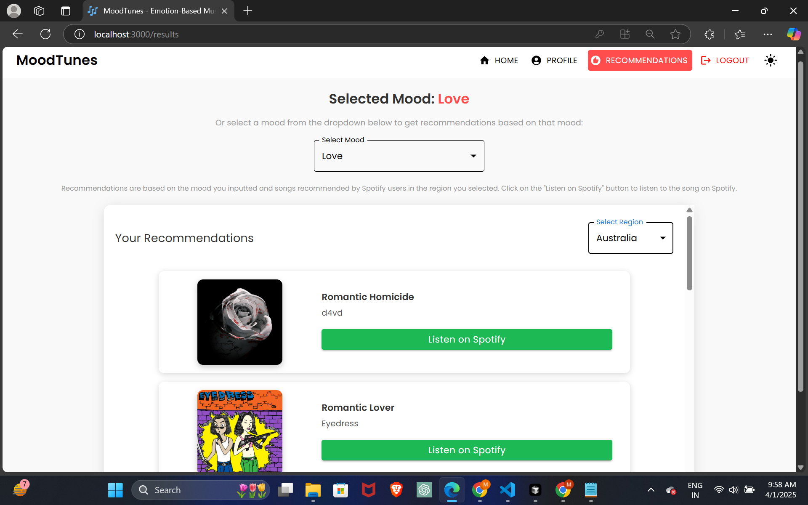

# **MoodTunes - Emotion-Based Music Recommendation App**

The **MoodTunes** project is an integrated emotion-based music recommendation system that combines frontend, backend, AI/ML models, and data analytics to provide personalized music recommendations based on user emotions. The application analyzes text, speech, or facial expressions and suggests music that aligns with the detected emotions.

<h2 id="-overview">🎵 Overview</h2>

MoodTunes provides personalized music recommendations based on users' emotional states detected through text, speech, and facial expressions. It interacts with a Django-based backend, AI/ML models for emotion detection, and utilizes data analytics for visual insights into emotion trends and model performance.

<h2 id="-technologies">🛠️ Technologies</h2>

Here is the list of technologies used in the Moodify project:

### **Frontend**:

### **Backend**:

### **Databases**:

### **AI/ML Models**:

<!-- 
### **Load Balancing**:

### **Data Analytics**:

### **Mobile (in progress)**:

### **Containerization, Deployment, and CI/CD**:

 -->

<h2 id="-user-interface">🖼️ User Interface</h2>

### Landing Page

  

### Landing Page - Dark Mode

  

### Home Page

  

<!-- #### Home Page - Dark Mode

  

 -->

#### Text Input

  

<!-- #### Text Input - Dark Mode

  

 -->

#### Speech Input

  

  

<!-- #### Speech Input - Dark Mode

  

 -->

#### Facial Expression Input

  

  

 #### Facial Expression Input - Dark Mode

  

 

### Profile Page

  

#### Profile Page - Dark Mode

  

#### Profile Page (Continued)

  

### Results - Recommendations Page

  

<!-- #### Results - Recommendations Page - Dark Mode

  

 -->

### Login Page

  

#### Login Page - Dark Mode

  

### Registration Page

  

<!-- #### Registration Page - Dark Mode

  

 -->

### **AI/ML Models Overview**

The AI/ML models are built using PyTorch, TensorFlow, Keras, and HuggingFace Transformers. These models are trained on various datasets to detect emotions from text, speech, and facial expressions.

The emotion detection models are used to analyze user inputs and provide real-time music recommendations based on the detected emotions. The models are trained on various datasets to capture the nuances of human emotions and provide accurate predictions.

- **Text Emotion Detection**: Detects emotions from text inputs.
- **Speech Emotion Detection**: Analyzes emotions from speech inputs.
- **Facial Emotion Detection**: Detects emotions from facial expressions.

The models are integrated into the backend API services to provide real-time emotion detection and music recommendations for users.

